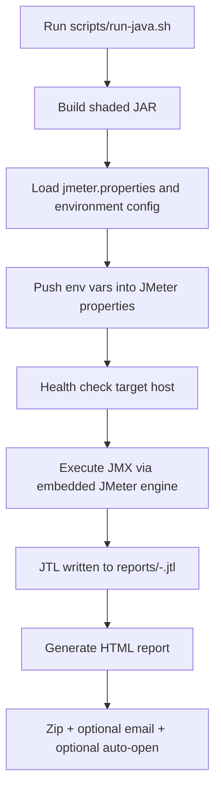

# Architecture Overview

## Runtime Flow


## CI Pipeline (GitHub Actions / Jenkins)
```mermaid
flowchart LR
  A[Checkout] --> B[Build shaded JAR]
  B --> C[Run baseline suite]
  C --> D[Publish artifacts (JTL/HTML/zip)]
```

## Key Components
- **Java runner**: `src/main/java/com/jmeter/suite/JMeterTestRunner.java`
- **Runner/config model**: `src/main/java/com/jmeter/suite/config/*`, `src/main/java/com/jmeter/suite/model/*`
- **Configs**: `config/environments/*.properties`, `config/jmeter.properties`, `bin/*` (log4j2, saveservice)
- **Plans**: `test-plans/*` (baseline + templates)
- **CI**: `.github/workflows/jmeter.yml`, `ci-cd/Jenkinsfile`
- **Scripts**: `scripts/run-java.sh`
